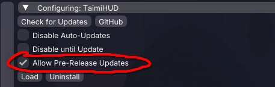
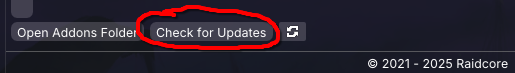

+++
title = "Feature Testing"
template = "page.html"
date = 2026-01-31
updated = 2026-04-23
aliases = ["/testers", "/alpha", "/beta"]
[extra]
header2 = true
+++

## Alpha Test (v0.5) {#alpha}

The current focus of our alpha test builds is [marker interactions](/faq/#interact).

The latest information about our ongoing alpha test including instructions and known issues is currently recorded in a Discord channel dedicated to testing experimental features.
[Click here to join as a tester](https://discord.gg/KcX67kFX2f).

A preview of new Goggles v2 features and improvements is also now available:

* Mumblelink camera performance improvements
* Auto-detection for calibration and more
* [UI masking](/gallery/dev-goggles03.webp)
* ["Projection"](/gallery/dev-goggles05.jpg) and [reflections](/gallery/dev-goggles04.webp)

## Beta Test {#beta}

None currently active.

## Prerelease (v0.4) {#rc}

For the slightly less adventurous, incoming new features are often available to try early through [Nexus pre-releases](#rc-nexus) before they're deemed ready. If you use these versions, please [report](/faq/#help) any bugs found so we can fix them before a stable release is made!

Currently, the following features and changes are available to those who opt in to the early updates:

* You can now link your ArenaNet account via API token to [hide markers related to completed achievements](/faq/#achievements)
* Cleanup behind the scenes to the addon's start-up and shutdown operation

Note that pre-releases are no longer required to get access to basic pathing functionality.

### Nexus opt-in {#rc-nexus}

1. Hit configure for TaimiHUD within Nexus.

    

2. Enable `Allow Pre-Release Updates` for TaimiHUD within the configure area.

    

3. Check for updates to make Nexus download the pre-release version of TaimiHUD.

    

### ArcDPS opt-in {#rc-arcdps}

(TODO: instructions incomplete, and idk if it even works if you're not already on 0.4 lol)

Manually enter the "`rc`" update channel under the advanced config options, then hit enter.
Check for updated and manually approve/allow it if it matches the prerelease version number [above](#rc).
Then hope it eventually works!

### Revert to stable {#rc-optout}

(TODO: instructions and feature incomplete)

Press the "revert to mainline" button to opt back out
(or change the update channel to "`release`") under the advanced update config options.
