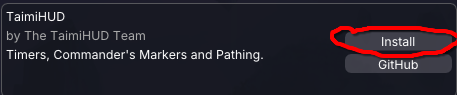
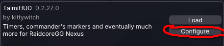
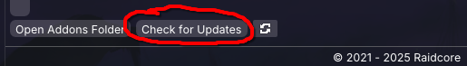
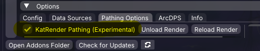

+++
title = "Install Guide"
template = "page.html"
date = 2025-11-22
+++

Credit to [Seres (@Seres67)](https://github.com/Seres67/) for taking these pictures.

## Platform recommendations

### Linux

Using Steam or [Heroic Launcher](https://heroicgameslauncher.com/) is likely best here. Please use some kind of Wine or Proton newer than Wine 8.

### MacOS

Using [Heroic Launcher](https://heroicgameslauncher.com/) is recommended on macOS. Please *for the love of all that is good in this world*, do not use Whiskey. They ship Wine 7. It's rough.

If you do pay for Crossover and wish to use it, set Graphics to DXMT, Synchronization to MSync and in `winecfg` set `d3d11.dll` to `native-then-builtin`. A user reports that DXVK was extremely stuttery and D3DMetal doesn't work properly with Nexus.

### Windows

It already works?

## Instructions and supported addon loaders {#install}

### Nexus

0. Have [Nexus](https://raidcore.gg/Nexus) installed.
1. Launch the game to find and install TaimiHUD within the Nexus Library.

    

2. Install some packs from the [in-game downloads](#paths) and explore from there!

#### Prereleases, if you want them {#rc}

See also: [Feature Testing](/testers/)

1. Hit configure for TaimiHUD within Nexus.

    

2. Enable `Allow Pre-Release Updates` for TaimiHUD within the configure area.

    

3. Check for updates to make Nexus download the pre-release version of TaimiHUD.

    

### ArcDPS

0. Have [ArcDPS](https://www.deltaconnected.com/arcdps/) installed.
1. Obtain the [latest release for TaimiHUD](https://github.com/TaimiHUD/TaimiHUD/releases).
2. Place the DLL into the same folder as ArcDPS's dll \
    (usually the equivalent of `C:\Program Files\Guild Wars 2\` for your system).

## Pathing enablement {#paths}

1. Enable `KatRender Pathing (Experimental)` from within the TaimiHUD window's Pathing Options tab.

    

    When installed by Nexus, most settings can alternatively be reached through the Configure area for the addon:

    

2. Within the Data Sources tab of the TaimiHUD primary window and settings, refresh the data sources list.

    

3. Install the pathing packs you desire.

4. Open the Pathing window to customize your experience. It can be accessed with the keybind found in Nexus or ArcDPS settings, as well as by the Nexus quick-access button at the top of the screen.

    
