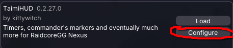

+++
title = "Install Guide"
template = "page.html"
date = 2025-11-22
updated = 2026-07-08
[extra]
header2 = true
+++

Credit to [Seres (@Seres67)](https://github.com/Seres67/) for taking these pictures.

## Running with an addon loader {#install}

Choose one of the supported addon loaders below.
[Nexus](#nexus) is the easiest way to get started, but it's not required
if you're already running [ArcDPS](#arcdps).
TaimiHUD does not have a standalone mode at this time, so a loader will be needed.

These instructions assume you're already running Guild Wars 2.
If you're also migrating from Windows then it may help to look over our [recommendations](#platform-recommendations) for Linux and MacOS further down in the guide.

### Nexus

Nexus is a beginner-friendly platform to obtain and manage installed addons.

0. Have [Nexus](https://raidcore.gg/Nexus) installed.
1. Launch the game to find and install TaimiHUD within the Nexus Library.

    

2. [Opt in to prerelease updates](/docs/testers/#rc-nexus) if you want to preview [new features](/docs/testers/#rc).

3. Install some packs from the [in-game downloads](#paths) and explore from there!

### ArcDPS

TaimiHUD can run as an ArcDPS extension as an alternative to using Nexus.
There's nothing to do here if you're using Nexus but also have ArcDPS installed.

0. Have [ArcDPS](https://www.deltaconnected.com/arcdps/) installed.
1. Obtain the [latest release for TaimiHUD](https://github.com/TaimiHUD/TaimiHUD/releases).
2. Place the DLL into the same folder as ArcDPS's dll \
    (usually the equivalent of `C:\Program Files\Guild Wars 2\` for your system).

## Path enablement {#paths}

1. Enable `KatRender Pathing (Experimental)` from within the TaimiHUD window's Pathing Options tab.

    

    When installed by Nexus, most settings can alternatively be reached through the Configure area for the addon:

    

2. Within the Data Sources tab of the TaimiHUD primary window and settings, refresh the data sources list.

    

3. Install the pathing packs you desire.

4. Open the Pathing window to customize your experience. It can be accessed with the keybind found in Nexus or ArcDPS settings, as well as by the Nexus quick-access button at the top of the screen.

    

## Additional support {#support}

Try checking our [FAQ](/faq/) for information about common problems,
then [reach out to us](/faq/#help) if you need additional help getting started.

Some platform recommendations<a id="platform-recommendations" href="#platform-recommendations">🔗</a>
are provided here for non-Windows players who may encounter issues while setting up TaimiHUD
under Wine or don't have Guild Wars 2 up and running yet.

### Linux

Using Steam or [Heroic Launcher](https://heroicgameslauncher.com/) is likely best here. Please use some kind of Wine or Proton newer than Wine 8.

### MacOS

Using [Heroic Launcher](https://heroicgameslauncher.com/) is recommended on macOS. Please *for the love of all that is good in this world*, do not use Whiskey or Apple's Game Porting Toolkit. They ship Wine 7. It's rough.

(If there's a guide out there that's helped you with this setup, let us know so we can share it here!)

Some have reported success with a variety of setups:

* One CrossOver customer suggests: set Graphics to DXMT, Synchronization to MSync.
  DXVK may be "extremely stuttery" and D3DMetal may not work properly with Nexus.
* A recent Sikarugir Engine (1.0.11/10.0.5 at time of report) may work with D3DMetal.

It's usually necessary to use `winecfg` to set the `d3d11.dll` library to `native-then-builtin`.
